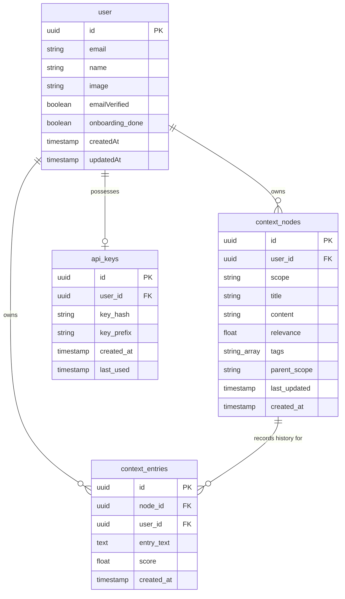

# ContextGraph — Product & Technical Architecture Document
Version 1.0 | Created: June 2026

ContextGraph is a cross-AI personal context engine designed to solve the "zero-context problem" in AI-driven development. By maintaining a structured, user-owned context graph in a centralized database, ContextGraph enables any Model Context Protocol (MCP)-compatible AI client to read and update a user's profile, preferences, and project history.

This document provides a highly detailed walkthrough of ContextGraph's technology stack, architecture, database models, user flows, and code strategies.

---

## 1. System Overview & Problem Space

### The Problem: Zero-Context Sessions
Every time a developer starts a new chat with an AI assistant (Claude.ai, ChatGPT, Cursor, or Claude Code), the assistant starts with a blank slate. The user must repeatedly explain:
* Who they are (roles, skills, and communication constraints).
* The stack and libraries they are using for a specific project.
* The current state, status, and decisions made in the codebase.
Existing memory features are locked behind platform siloes (e.g., ChatGPT memory is not accessible to Claude Code) and lack structured graph relationships.

### The Solution: ContextGraph
ContextGraph acts as an independent, portable memory layer. 
1. **Multi-User Backend**: A Next.js API layer with server-side Supabase Database integration, authenticated via Better Auth for browser sessions and SHA-256 API key hashing for MCP tools.
2. **AI Judgment Layer**: Powered by OpenRouter free model cascade. It processes raw developer inputs during sessions, determines if updates are meaningful, and updates relevance scores.
3. **Interactive 3D Dashboard**: Built with Next.js App Router, Tailwind CSS v4, and Three.js/WebGL (via `react-force-graph-3d`), allowing users to inspect, modify, and delete context nodes.
4. **Multi-User MCP Endpoint**: Exposed over streamable HTTP at `/api/mcp` with CORS compliance, allowing native integration with external AI clients via headers or query parameters.

---

## 2. Technical Stack & Dependencies

### Core Frameworks
* **Next.js 16.2.6 (App Router)**: Powers the SaaS web app, settings dashboard, onboarding, and API routes.
* **TypeScript (Strict Mode)**: Enforces code contracts across databases, React components, and API schemas.
* **React 19.2.4 & React DOM**: Core UI libraries.

### Database & Security
* **Supabase (`@supabase/supabase-js` & `@supabase/ssr`)**: Leverages Supabase PostgreSQL as the primary datastore. App access is strictly server-side to prevent exposing secrets.
* **Better Auth (v1.6.11)**: Manages secure user registration, session management (cookie caching, 7-day expiration), and credentials. Uses PostgreSQL pool client (`pg` v8.20.0) directly connected to Supabase.
* **Node.js Crypto (`crypto`)**: Generates secure, high-entropy API keys (`ctx_...`) and computes SHA-256 hashes for database validation.

### Visualization & UI Graphics
* **Three.js (`three` v0.184.0) & `react-force-graph-3d` (v1.29.1)**: Dynamically renders the interactive 3D node-link graph on a WebGL canvas in the browser.
* **Lucide React (v1.14.0)**: Clean, editorial outline SVG icons.

### Animations & Performance
* **GSAP (v3.15.0) & `@gsap/react`**: Handles all high-performance entrance transitions, spring physics, and modular animations. Excludes standard CSS `@keyframes` in favor of GSAP-scaped tweens.
* **Lenis (v1.3.23)**: Manages page-level smooth scrolling. Synced with GSAP's requestAnimationFrame (RAF) loop to coordinate visual transitions.

### AI Engine
* **OpenAI SDK (`openai` v6.37.0)**: Used as a client wrapper pointing to **OpenRouter** (`https://openrouter.ai/api/v1`) to execute structured JSON queries using high-quality free models.

### CSS & Styling
* **Tailwind CSS v4 (with `@tailwindcss/postcss`)**: Provides a modern utility-first framework. Bridges design system variables into theme classes (e.g., `text-display-xxl`, `color-accent`).

---

## 3. Database Schema & Models

ContextGraph uses a dual-ownership model: Better Auth manages internal authentication tables (`user`, `session`, `account`, `verification`), while custom application tables map context graphs.



### Table Specifications

#### 1. `user`
Better Auth's core user identity table, extended with custom field mapping.
* `id` (UUID, Primary Key): Unique identifier.
* `email` (Text, Unique): User's primary email.
* `name` (Text): Profile name.
* `onboarding_done` (Boolean, Default: `false`): Flags whether the user completed the onboarding wizard.

#### 2. `context_nodes`
Stores the hierarchical graph nodes.
* `id` (UUID, Primary Key, Default: `uuid_generate_v4()`): Node identifier.
* `user_id` (UUID, Foreign Key → `user.id`): Enforces tenant scoping.
* `scope` (Text): Slug representing hierarchy path (e.g., `me`, `agency`, `personal/project-slug`, `agency/project-slug`).
* `title` (Text): Visual label of the node (e.g., `ME`, `ContextGraph`).
* `content` (Text): The primary markdown text injected into the AI's system prompt.
* `relevance` (Numeric, Range: `0.0` - `1.0`): Indicates how fresh/important this node is.
* `tags` (Text[]): Array of tech stacks or classifications.
* `parent_scope` (Text, Nullable): References the `scope` of the parent node to determine graph links.

#### 3. `context_entries`
Log history of AI `/save` updates (the "Decisions Log" panel).
* `id` (UUID, Primary Key): Entry identifier.
* `node_id` (UUID, Foreign Key → `context_nodes.id` ON DELETE CASCADE): Target node.
* `user_id` (UUID, Foreign Key → `user.id`): Tenant scoping.
* `entry_text` (Text): Bullet point describing the modification.
* `score` (Numeric): Importance score generated by AI judgment (`0.0` - `1.0`).

#### 4. `api_keys`
Secures remote MCP connections.
* `id` (UUID, Primary Key): Key identifier.
* `user_id` (UUID, Foreign Key → `user.id`, Unique): Enforces a single active API key per user.
* `key_hash` (Text, Unique): SHA-256 hash of the full API key. Matches incoming requests.
* `key_prefix` (Text): The first 12 characters of the API key (e.g., `ctx_abcdefgh`), exposed in the UI.
* `last_used` (Timestamp, Nullable): Tracks usage activity.

---

## 4. System Architecture

ContextGraph utilizes Next.js App Router Route Handlers as Server Actions, operating in a zero-trust architecture.

```
+------------------+     Browser (HTTPS)     +-----------------------------+
|  Dashboard UI    | <=====================> |    Next.js API Routes       |
|  (React/WebGL)   |   Better Auth Session   |  (e.g., /api/context/[id])  |
+------------------+                         +-----------------------------+
                                                            ||
+------------------+    Remote MCP (JSON-RPC)                ||  (Server-Side Only)
|  External AIs    | <=====================> +-----------------------------+
|  (Claude Code,   |   Header: x-api-key     |    Supabase PostgreSQL      |
|   Claude.ai)     |   URL Param: ?key=      |    (User-private Data)      |
+------------------+                         +-----------------------------+
                                                            ||
                                                     (Fallback Cascade)
                                             +-----------------------------+
                                             |       OpenRouter API        |
                                             |   (Gemma-4 / Llama-3 / Qwen)|
                                             +-----------------------------+
```

### 4.1 Tenant Authorization & Auth Scoping
Security is governed by two authentication schemes:
1. **SaaS Web Session**: Protected by Better Auth middleware. Page requests and database helpers resolve user details from the session cookie. Inline browser components never request Supabase directly. All database access goes through server-side helper modules (`requireSessionUser()` -> `getUserNodes()`).
2. **MCP HTTP Session**: Remote AI clients call `/api/mcp` without cookies. Instead, they authenticate by sending the plaintext API key via the `x-api-key` header or `key` query parameter. The server hashes this key using SHA-256 and queries `api_keys` to identify the associated `user_id`.

### 4.2 Streamable HTTP MCP Endpoint (`/api/mcp`)
Next.js handles remote MCP requests inside `app/api/mcp/route.ts` as a JSON-RPC 2.0 streaming-compliant endpoint.
* **CORS compliance**: Custom headers permit cross-origin access from desktop clients:
  ```json
  {
    "Access-Control-Allow-Origin": "*",
    "Access-Control-Allow-Methods": "GET, POST, DELETE, OPTIONS",
    "Access-Control-Allow-Headers": "Content-Type, mcp-session-id, x-api-key"
  }
  ```
* **Protocol initialization**: Matches standard MCP lifecycle methods (`initialize`, `notifications/initialized`, `tools/list`, `tools/call`).

### 4.3 AI Judgment Layer & OpenRouter Cascade
To operate under a zero-cost tier, ContextGraph integrates with OpenRouter's free API cascade in `lib/openrouter.ts`. 

```typescript
const MODEL_CASCADE = [
  'minimax/minimax-m2.5:free',
  'qwen/qwen3-next-80b-a3b-instruct:free',
  'meta-llama/llama-3.3-70b-instruct:free',
  'google/gemma-4-26b-a4b-it:free',
  'google/gemma-4-31b-it:free',
]
```

When an LLM call fails due to rate limits (`429`), model deprecation (`404`), or gateways (`502`/`503`), the call catches the error, logs a warning, and falls through to the next model in the list. Non-transient errors (such as authentication or bad requests) abort execution immediately.

---

## 5. Core MCP Tools

Two primary tools are exposed to external AI clients:

### 5.1 `get_context`
* **Input Schema**: `scope: string` (required).
* **Behavior**: Fetches all database nodes associated with the verified user.
* **Assembly Strategy** (`lib/context.ts`):
  * **Always** appends the `me` root node (user profile, preferences).
  * If the scope is `me`, returns only this node.
  * If the scope starts with `agency`, appends the general `agency` node.
  * If the scope contains a sub-path (e.g., `personal/project-slug` or `agency/project-slug`), matches the exact path slug and appends it to the markdown output.
  * Ensures that unrelated project contexts remain isolated, optimizing the AI's token window.

### 5.2 `save_context`
* **Input Schema**: `summary: string`, `scope: string`, `goal: string`, `achieved: boolean`.
* **Behavior**: Evaluates a completed development session.
* **AI Judgment & Insertion**:
  * Formulates a prompt evaluating if the session changes warrant permanent memory updates.
  * OpenRouter evaluates and returns a structured JSON payload:
    ```json
    {
      "should_save": true,
      "reason": "Successfully set up client authentication middleware.",
      "entry": "2026-06-14: Configured Better Auth endpoints for multi-tenant middleware.",
      "score": 0.85,
      "target_scope": "personal/auth-module"
    }
    ```
  * If `should_save` is `true`, it writes a new record to `context_entries` containing the score and entry text, and updates the target node's `relevance` score (clamping it to a maximum of `1.0`).

---

## 6. Front-End Features & Design Implementation

ContextGraph implements a high-end, editorial look and feel governed by `DESIGN.md`.

### 6.1 Color System & Surface Textures
* **Electric Lime Accent (`--accent: #b3ec13`)**: Applied sparingly (max one element per viewport) to indicate focused inputs, active toggle tabs, or high-relevance nodes.
* **Overhead Lighting Shadows**: All UI panels and cards leverage multi-layered shadows combined with a custom inset outline (`--shadow-inset: inset 0 1px 0 rgba(255,255,255,0.05), inset 0 -1px 0 rgba(0,0,0,0.2)`) which simulates a physical card catching overhead ceiling light.
* **Tactile Noise Grain**: Landing hero sections overlay a custom 3% opacity seamless noise SVG, giving surfaces a textured, physical appearance.

### 6.2 Interactive 3D Graph (Three.js/WebGL)
Implemented inside `components/graph/ContextGraph3D.tsx` to display structural nodes.
* **Hierarchical Node Tiers**: Nodes encode depth and relevance. The root (`me`) is rendered largest in Electric Lime; child nodes (`agency`/`projects`) are scaled down and styled in white and text-secondary gray.
* **OrbitControls Drag Fix**: Standard Three.js `OrbitControls` crash when dragging nodes because pointer tracker arrays become out-of-sync during `pointercancel` events. ContextGraph resolves this by capturing node dragging events and disabling OrbitControls during drag operations:
  ```typescript
  const handleNodeDrag = useCallback(() => {
    const fg = graphRef.current;
    if (!fg) return;
    const controls = fg.controls();
    if (controls?.enabled) controls.enabled = false;
  }, []);

  const handleNodeDragEnd = useCallback((node: any) => {
    if (node) {
      node.fx = undefined; node.fy = undefined; node.fz = undefined;
    }
    const fg = graphRef.current;
    if (fg) fg.controls().enabled = true;
  }, []);
  ```

### 6.3 Animation Coordination (GSAP + Lenis)
* **Custom Easing**: GSAP registers four precise Bezier easing curves in `lib/gsap.ts` to replace CSS transitions:
  * `cg-out` (`0.16, 1, 0.3, 1`): Smooth deceleration for entering elements.
  * `cg-in` (`0.7, 0, 0.84, 0`): Clean acceleration for exiting items.
  * `cg-spring` (`0.34, 1.56, 0.64, 1`): Dynamic overshoot spring bounce for interactive selections.
  * `cg-soft` (`0.25, 0.46, 0.45, 0.94`): Page transitions.
* **Unified RAF loop**: Lenis smooth scrolling ticks inside GSAP's RequestAnimationFrame loop:
  ```typescript
  lenisInstance.on('scroll', ScrollTrigger.update);
  gsap.ticker.add((time) => {
    lenisInstance?.raf(time * 1000);
  });
  ```
* **Accessibility**: Every animation calls `prefersReducedMotion()`. If enabled on the client OS, GSAP tweens are bypassed, executing direct `gsap.set()` operations to avoid visual distress.

---

## 7. Core Workflows & Step-by-Step Data Traces

### 7.1 Signup & Onboarding Flow
```
User registers -> Better Auth creates user -> API key generated -> Onboarding Wizard
                                                                        |
Dashboard <- AI initializes graph <- POST /api/onboarding <- User submits answers
```
1. **User Sign Up**: User enters name, email, and password. Better Auth commits user credentials to the database.
2. **Onboarding Form**: User completes a 4-step wizard:
   * *Step 1*: Personal identity & current role.
   * *Step 2*: Technical skills and stack selection.
   * *Step 3*: Up to 3 active projects.
   * *Step 4*: Main goals & AI interaction style.
3. **Graph Generation**: On submission, a POST request is sent to `/api/onboarding`.
   * The endpoint makes a structured call to OpenRouter.
   * OpenRouter generates the initial set of nodes in a JSON schema (maximum 6 nodes, including `me` as root).
   * The API hashes a newly created key `ctx_...`, stores it in `api_keys`, and updates the user's status to `onboarding_done: true`.
4. **Key Display**: The dashboard displays the plaintext API key in a secure modal exactly once, requiring the user to copy it to proceed.

### 7.2 Session Update Flow (`/save`)
```
AI client (Claude Code) -> tool:save_context -> POST /api/mcp (API key authenticated)
                                                    |
Dashboard updates <- DB inserts entry <- AI evaluates summary (should_save?)
```
1. **Session Wrap-up**: In Claude Code or Claude.ai, the user types `/save`.
2. **MCP Call**: The AI initiates a remote tool call using `save_context(summary, scope, goal, achieved)`.
3. **Request Verification**: `/api/mcp` receives the request, extracts the API key, hashes it, and queries Supabase to resolve the user ID.
4. **Decision Logic**: The endpoint queries OpenRouter to evaluate the summary.
   * *If rejected*: Returns a text confirmation to the client explaining why the update was skipped.
   * *If accepted*: Inserts the summary to `context_entries` and updates the node's `relevance` score.
5. **UI Sync**: The client dashboard dynamically fetches the new entries and reflects the updated relevance score visually in the 3D graph and sidebar tree.

### 7.3 Weekly Relevance Decay
```
Vercel Cron -> GET /api/cron/decay (Bearer Token check) -> decayRelevanceScores() -> DB update
```
1. **Vercel Cron Trigger**: A weekly cron request hits `app/api/cron/decay/route.ts` with a `Bearer ${CRON_SECRET}` authorization header.
2. **Age Threshold Analysis**: Queries all `context_nodes` where `last_updated` is older than 30 days.
3. **Exponential Decay**: Iterates over stale nodes, multiplying their current relevance score by `0.92` (representing an 8% decay rate per week) down to a minimum floor of `0.1`.
4. **Visual Dimming**: When the user loads the dashboard, nodes with decayed relevance are visualised with dimmed borders and text elements:
   * *Relevance > 0.7*: Active border, bright text.
   * *Relevance 0.4–0.69*: Muted border, secondary text.
   * *Relevance < 0.4*: Dimmest border, archived text style.

---

## 8. Complexity & Implementation Challenges

### 8.1 orbit-control WebGL Conflicts
Using Three.js in a React ecosystem introduces lifecycle challenges. If React state triggers a rerender of parent elements, the WebGL canvas can easily lose mouse-tracking state, leading to coordinate exceptions during node drag operations. Disabling controls during drags ensures safe WebGL operations.

### 8.2 Client-Side Hydration (Three.js)
Three.js uses document features that cannot be executed during Server-Side Rendering (SSR). ContextGraph solves this by wrapping the 3D graph canvas in a Next.js `dynamic()` import with `ssr: false`:
```typescript
const ForceGraph3D = dynamic(
  () => import('react-force-graph-3d'),
  { ssr: false }
)
```

### 8.3 Plaintext API Key Leak Prevention
Plaintext API keys are never stored in the database. Instead, only the SHA-256 hash of the key is saved. When API keys are validated, the input key is hashed and matched against the database. Plaintext keys are shown only once at creation time, preventing database leaks from exposing active keys.

### 8.4 Free API Rate Limiting
Relying on free OpenRouter models introduces rate limits. The model cascade logic in `lib/openrouter.ts` acts as a fail-safe, sequentially trying alternative models before raising an API exception. This ensures maximum uptime under zero-cost usage.

### 8.5 Node Depth and Sorting Algorithms
Sidebar node trees require hierarchical rendering based on graph links.
* **Depth Resolution**: `computeDepths` builds a map of parent relationships and recursively resolves node depth (`0` for root, `1` for immediate children, etc.).
* **Hierarchical Sorting**: `sortNodesHierarchically` traverses nodes from the roots down, sorting siblings alphabetically by title to keep the sidebar structured.

---

## 9. Future Product Roadmap

1. **Auto-Import Integrations**: Expose endpoints to import raw markdown exports directly from ChatGPT memory and Claude personal context files.
2. **Scoped Shared Links**: Allow users to generate read-only access links to specific sub-graphs (e.g., sharing a project's context with a client).
3. **Key Labels and Scoped Keys**: Support generating multiple active API keys with specific scope limits (e.g., a read-only key for a documentation bot).
4. **Browser Extension**: A Chrome utility that automatically injects the active context scope into web-based chat interfaces (Claude.ai, ChatGPT) without requiring native CLI setups.
